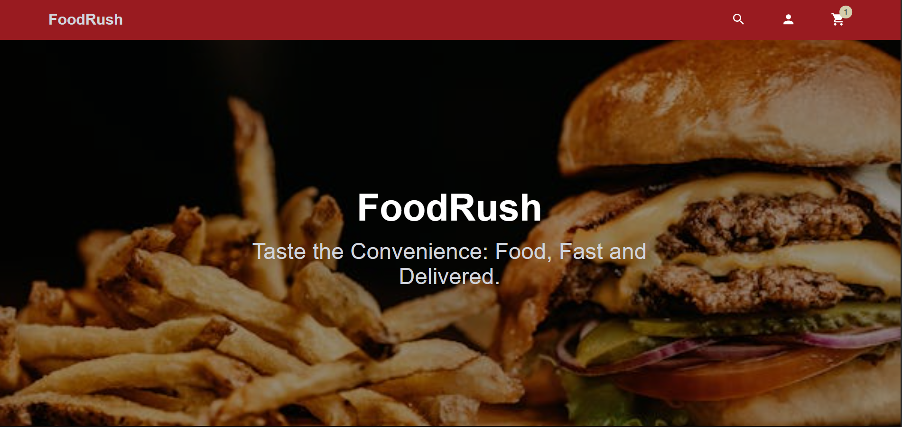

# 🍽️ Online Food Ordering App

Une application web complète de commande de nourriture, construite avec **Spring Boot** pour le backend et **React.js (Vite)** pour le frontend.

> Ce projet a été conçu pour apprendre le développement d'une architecture complète (full-stack) avec des technologies modernes et bien structurées.

---

## 🖼️ Aperçu

---

## 🛠️ Stack Technique

### 💻 Frontend (React + Vite)

- React.js
- Vite.js
- MUI
- Axios
- Tailwind
- React Router

### 🖥️ Backend (Spring Boot)

- Spring Boot
- Spring Security (authentification)
- Spring Data JPA (base de données)
- MySQL
- Maven

---

## 📦 Structure du projet
